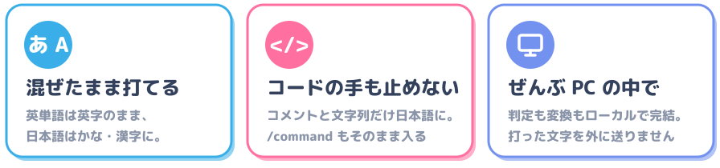
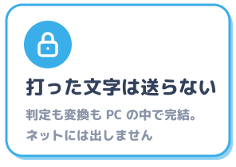
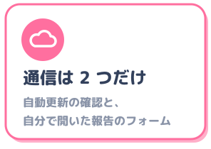
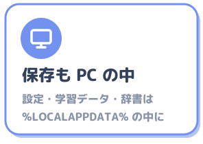
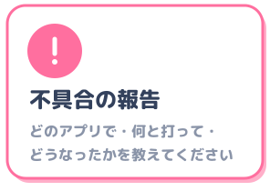

> 上流 [yksr-melt/Meltype](https://github.com/yksr-melt/Meltype) の README (v1.1.1、`ccb541b9a2f2f41034760c500ee8b38d0d932771`) です。2026-10-09 に更新し、この文書からの相対リンクを調整しました。Android 版の導入・設定は [この fork の README](../README.md) を参照してください。

<p align="center">
  <br>
  <sub>Logo by <a href="https://github.com/Crysta1221">@Crysta1221</a></sub>
</p>

<p align="center"><b>雪解けのように、半角/全角の壁を溶かす日本語入力。</b></p>

<p align="center">
  <a href="https://github.com/yksr-melt/Meltype/releases/latest"></a>
  <a href="https://github.com/yksr-melt/Meltype/releases"></a>
  <a href="../LICENSE"></a>
</p>

<p align="center">
  <a href="https://trendshift.io/repositories/284759?utm_source=trendshift-badge&amp;utm_medium=badge&amp;utm_campaign=badge-trendshift-284759" target="_blank" rel="noopener noreferrer"></a>
</p>

<h3 align="center">半角/全角 キーは、もう押さなくていい！</h3>

<p align="center">
ローマ字で打つだけ。日本語か英語かは Meltype が見分けて、その場で切り替えます！
</p>

<p align="center">
  <a href="https://github.com/yksr-melt/Meltype/releases/latest"><b>ダウンロード</b></a>
  &nbsp;·&nbsp;
  <a href="USAGE.md">使い方</a>
  &nbsp;·&nbsp;
  <a href="https://github.com/yksr-melt/Meltype/issues/new/choose">不具合の報告・提案</a>
</p>

<p align="center">
  
</p>

<br><br>

<br>

<p align="center">
  
</p>

<a name="たとえば"></a>


```
kyouhagoogledekensaku    →  今日はgoogleで検索
ashitanomeetingwotsuika  →  明日のmeetingを追加
I want to go to the park →  I want to go to the park
```

英単語は英字のまま、日本語はかな・漢字に。英文だってそのまま入ります！
VS Code やターミナルでは英数が基本で、コメントと文字列の中だけ日本語に。AI エージェントの `/command`・`$skill`・`@ファイル名` も、変換されずにそのまま入ります。

<a name="ほかにも"></a>


えがお → 😊 の絵文字変換、ブレスレッド → ブレスレット のような書き間違いの指摘、予測変換、アプリごとの設定など。

<sub>Windows 10 / 11 に対応。Mac 版・Linux 版はプレビュー版です。</sub>

<br><br>

<br>

1. [Releases](https://github.com/yksr-melt/Meltype/releases/latest) から `Meltype-<version>-setup.exe` をダウンロード
2. 開いて、案内どおりに進める
3. タスクトレイに「あ」が出たら準備完了！

管理者権限は不要 (Meltype IME を入れるときだけ確認が出ます。断っても使えます)。新しい版は自動で入ります。

「Windows によって PC が保護されました」と出たら、「詳細情報」→「実行」。コード署名をしていないため表示されます。

<details>
<summary>zip 版・Mac 版・Linux 版</summary>

| | ファイル |
|---|---|
| Windows (zip) | `Meltype-<version>-windows.zip` を展開して `Install.cmd` をダブルクリック |
| Mac (プレビュー版) | `Meltype-<version>-mac.zip` ([mac/README.md](../mac/README.md)) |
| Linux (プレビュー版) | `Meltype-<version>-linux.zip` (IBus / fcitx5) |

インストーラーでも zip でも、入る場所は同じ `%LOCALAPPDATA%\Programs\Meltype` です。
Windows 版に必要なのは Windows 10 / 11 (64bit) と Microsoft IME だけで、.NET は同梱しています。

</details>

<details>
<summary>「ウイルスを検出しました」と出たとき</summary>

SmartScreen の警告とは別のものです。誤検知のこともありますが、検出名だけでは見分けられません。

1. Windows セキュリティ →「ウイルスと脅威の防止」→「保護の更新」で定義を新しくする
2. 公式のリリースからダウンロードし直して、もう一度検査する
3. それでも検出されるときは、保護を切ったりフォルダーを除外したりせずに、「保護の履歴」で検出名を確かめて [Issues](https://github.com/yksr-melt/Meltype/issues) で教えてください。個人名やパス、ダウンロード URL の一時トークンは隠してください

ファイルが本物か確かめたいときは、リリースのページにある SHA-256 と比べられます。PowerShell なら `Get-FileHash .\Meltype-<version>-windows.zip` です。

</details>

<details>
<summary>アンインストール</summary>

トレイのアイコンを右クリックして「アンインストール...」を選ぶか、Windows の「設定」→「アプリ」から消せます。
インストーラーで入れた場合は、最後に設定と学習データも消すかを聞かれます。zip 版は `Uninstall.cmd` でも消せて、こちらは設定と学習データもまとめて消えます。

</details>

<br><br>

<br>

あとは、いつもどおりローマ字で打つだけ！

- **Meltype IME を入れた場合**: <kbd>Win</kbd> + <kbd>Space</kbd> で「Meltype」を選ぶ。文字は入力欄に直接入り、候補は入力位置の下に
- **入れていない場合**: カーソルの下に変換ボックスが出る

| キー | |
|---|---|
| <kbd>Enter</kbd> | 確定 |
| <kbd>Space</kbd> | 候補を出して選ぶ (4 文字以上は打つそばから漢字になる。短い語は Space で変換) |
| <kbd>F7</kbd> / <kbd>F10</kbd> | カタカナ / 英字 |
| <kbd>半角/全角</kbd> | 英数と日本語の切り替え |
| <kbd>Ctrl</kbd> + <kbd>半角/全角</kbd> | Meltype を一時停止 |

<kbd>F10</kbd> で英字に直した語は、次から英字で出ます。使うほど自分に合っていきます！
よく使う言葉は、トレイのメニューの「ユーザー辞書...」から登録。くわしくは [docs/USAGE.md](USAGE.md)。

<br><br>

<br>

<details>
<summary>タスクバーの IME の表示がずっと「A」のまま</summary>

故障ではありません。Meltype が Windows の IME に代わって入力を受け持っているためです。
今のモードは、カーソルの近くに出る「あ」「A」か、トレイのアイコンで確認できます。

</details>

<details>
<summary>Google 日本語入力など、ほかの IME も使いたい</summary>

<kbd>Ctrl</kbd> + <kbd>半角/全角</kbd> で Meltype を一時停止すれば使えます。

</details>

<details>
<summary>英語のつもりがかなに、かなのつもりが英字になった</summary>

<kbd>F10</kbd> (英字) か <kbd>F6</kbd> (ひらがな) で直して確定すれば、次からはその語を覚えています。
トレイのメニューの「自動判定の強さ」でも調整できます。

</details>

<details>
<summary>おかしな動きを見つけた</summary>

トレイのメニューの「不具合の報告・提案...」から送れます。
「どのアプリで」「何と打って」「どうなったか」があると、すぐに調べられます。

</details>

<br><br>

<br>

<p align="center">
  
  
  
</p>

保存するのは `%LOCALAPPDATA%\Meltype` の設定・学習データ・ユーザー辞書 (と、ON にしたときのログ) だけです。
セキュリティの方針と脆弱性の連絡先は [SECURITY.md](../SECURITY.md) にあります。

<br><br>

<br>

<p>
  <a href="../LICENSE"></a>
  
  
</p>

[GNU GPL v3.0](../LICENSE)。個人でも会社でも無料。GPL v3 の条件 (改造版もソースを公開) で、改造・再配布も自由です。

ソースを公開せずに製品へ組み込みたいなど、GPL v3 で使えない場合はご相談ください: ibutya0319@gmail.com

<details>
<summary>著作権表示・同梱物</summary>

```
Meltype
Copyright (C) 2026 雪代 / Yukishiro (@yksr_melt / @yksr-melt)

This program is free software: you can redistribute it and/or modify it under the terms of the
GNU General Public License as published by the Free Software Foundation, either version 3 of the
License, or (at your option) any later version.

This program is distributed in the hope that it will be useful, but WITHOUT ANY WARRANTY; without
even the implied warranty of MERCHANTABILITY or FITNESS FOR A PARTICULAR PURPOSE. See the GNU
General Public License for more details.
```

ソースファイルには `SPDX-License-Identifier: GPL-3.0-or-later` を付けています。
同梱している .NET ランタイム (MIT) と、使っている Windows の機能については [THIRD-PARTY-NOTICES.md](../THIRD-PARTY-NOTICES.md) を見てください。
ロゴ ([docs/meltype.jpg](meltype.jpg)・[docs/images/logo.png](images/logo.png)) は [@Crysta1221](https://github.com/Crysta1221) さんに描いていただきました。

</details>

<br><br>

<br>

<a name="super-thanks"></a>


<table>
  <tr>
    <td align="center">
      <a href="https://github.com/Crysta1221"><br><b>@Crysta1221</b></a><br>
      <sub>Meltype のロゴ</sub>
    </td>
  </tr>
</table>

<a name="テスト版で協力してくださった方々"></a>


テスト版で不具合の報告や意見をくださった皆さん、本当にありがとうございました！ (敬称略)

- くらいど！ ([@Kuraido8888](https://x.com/Kuraido8888))
- しぐれ ([@Akisameee0465](https://x.com/Akisameee0465))
- 琴音Link
- あげちゃ
- うな ([@una08142009](https://x.com/una08142009))
- かふぇらて ([@cafely_latte](https://x.com/cafely_latte))
- ウパー ([@upah_setu](https://x.com/upah_setu))
- Ray
- うぽつです ([@up2ds](https://x.com/up2ds))

<a name="コードで協力してくださった方々"></a>


<a href="https://github.com/yksr-melt/Meltype/graphs/contributors">
  
</a>

<br><br>

<br>

不具合の報告、辞書の追加、Pull Request、どれも大歓迎です！

<p align="center">
  <a href="https://github.com/yksr-melt/Meltype/issues/new/choose"></a>
  <a href="../CONTRIBUTING.md#辞書の追加"></a>
  <a href="../CONTRIBUTING.md"></a>
</p>

- 送り方 → [CONTRIBUTING.md](../CONTRIBUTING.md)
- ビルド・仕組み → [docs/DEVELOPMENT.md](DEVELOPMENT.md)
- Mac の CLI ビルド → [docs/MAC-CLI.md](MAC-CLI.md)、WSL / Linux の CLI ビルド → [docs/WSL.md](WSL.md)

<br><br>

<br>

<a href="https://www.star-history.com/?repos=yksr-melt%2FMeltype&type=date&legend=top-left">
 <picture>
   <source media="(prefers-color-scheme: dark)" srcset="https://api.star-history.com/chart?repos=yksr-melt/Meltype&type=date&theme=dark&legend=top-left" />
   <source media="(prefers-color-scheme: light)" srcset="https://api.star-history.com/chart?repos=yksr-melt/Meltype&type=date&legend=top-left" />
   
 </picture>
</a>
